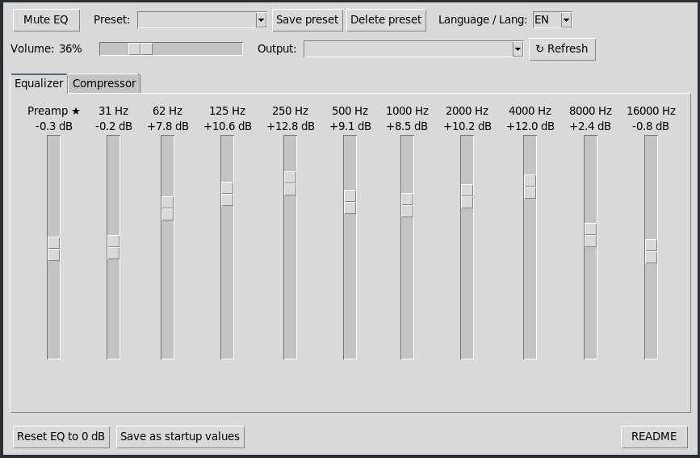

# Ecualizador + Compresor para PipeWire


-orange)

-blue)




GUI en Python (Tkinter) con control en vivo de un ecualizador de 10 bandas + preamp, encadenado a un compresor dinámico (Calf), implementados como sinks virtuales de PipeWire (`libpipewire-module-filter-chain`).

No depende de PulseAudio real ni de EasyEffects — controla directamente los nodos del filter-chain vía `pw-cli`.

## Compatibilidad

No hay nada específico de arquitectura. Funciona en cualquier distro Linux con PipeWire moderno (x86_64, ARM, etc.).  

Probado en:

- Orange Pi 5 Max (RK3588, aarch64) — Armbian, PipeWire 1.4.2

## Requisitos

- PipeWire 0.3.50+ (con `filter-chain`)
- calf-plugins
- python3-tk (GUI, Tkinter)
- pactl
- pw-cli / pw-dump
- lilv-utils (opcional, para inspeccionar otros plugins LV2)

  - Módulos python:
    - import json
    - import math
    - import datetime
    - import locale
    - import os
    - import re
    - import subprocess
    - import sys
    - import tkinter as tk
    - from tkinter import ttk, simpledialog, messagebox

## Instalación típica en Debian/Ubuntu/Armbian:

```bash
sudo apt install calf-plugins python3-tk
```

## Ubicación de los archivos

Para que la GUI pueda mostrar el archivo README desde su botón de lectura integrado, es necesario que los archivos de documentación (`README.md` o `README.en.md`) se encuentren en el **mismo directorio** donde se ejecuta el script `eq_gui.py`.

```
eq.conf           → ~/.config/pipewire/pipewire.conf.d/eq.conf
compressor.conf   → ~/.config/pipewire/pipewire.conf.d/compressor.conf
eq_gui.py         → en cualquier ubicación, se ejecuta con python3
README.md  → en el mismo directorio del script (para accederlo desde la GUI)
README.en.md (opcional, en el mismo directorio del script)
```

La GUI genera además, en tiempo de ejecución (no versionar, son datos de usuario):

```
~/.config/eq-presets.json      → presets guardados por el usuario
~/.config/eq-last-state.json   → último estado (bandas + volumen), autogenerado al cerrar
```

### `eq.conf` — Equalizer Sink

Filter-chain con un nodo `preamp` (bq_highshelf) + 10 bandas `bq_peaking` (31 / 62 / 125 / 250 / 500 / 1000 / 2000 / 4000 / 8000 / 16000 Hz), encadenadas en serie. Expone el sink `effect_input.eq`.

Su salida (`effect_output.eq`) se enruta explícitamente al Compressor Sink vía `target.object = "effect_input.comp"` en `playback.props`.

### `compressor.conf` — Compressor Sink

Filter-chain con un único nodo LV2 (`http://calf.sourceforge.net/plugins/Compressor`), que es inherentemente estéreo (puertos `in_l`/`in_r`/`out_l`/`out_r`). Expone el sink `effect_input.comp`. Su salida es pasiva (`node.passive = true`) y se conecta automáticamente al sink real (hardware/bluetooth) que esté configurado como salida por defecto del sistema en el momento en que PipeWire carga el módulo.

**Por qué son dos archivos separados en vez de uno solo:** el compresor LV2 tiene puertos estéreo explícitos (`in_l`/`in_r`), mientras que las bandas del ecualizador son nodos "builtin" mono que PipeWire duplica automáticamente por canal. Mezclar ambos estilos en el mismo grafo produce un error de PipeWire (`invalid ports... input:2 / input:1 != output:2 / output:2`) y puede tumbar el servicio. Separarlos en dos sinks encadenados evita el problema por completo.

### `eq_gui.py`

GUI Tkinter con dos pestañas:

- **Ecualizador**: 11 sliders verticales (preamp + 10 bandas), rango ±20 dB, control en vivo sin cortes de audio.
- **Compresor**: Threshold, Ratio, Attack, Release, Makeup Gain, Knee, y un checkbox de Bypass. Esta pestaña se oculta automáticamente si `effect_input.comp` no está cargado (por ejemplo, si solo instalaste `eq.conf` sin el compresor).

En la barra superior e inferior:
- **Presets**: guardar/cargar/borrar combinaciones de las 10 bandas + preamp, persistidos en `~/.config/eq-presets.json` (JSON plano, editable a mano).
- **Silenciar EQ**: mute/unmute rápido del sink, sin cerrar la app.
- **Volumen**: slider maestro (0-150%) sobre `effect_input.eq`, vía `pactl set-sink-volume`.
- **Salida**: desplegable con los dispositivos de audio reales detectados (ALSA interno, HDMI, bluetooth, etc.), excluyendo los sinks virtuales del propio EQ/compresor. Al elegir uno, mueve el audio en vivo con `pactl move-sink-input`. El botón **↻** al lado refresca la lista sin reiniciar la app.
- **Guardar como valores de arranque**: Modifica de forma permanente los archivos de configuración (`eq.conf` y `compressor.conf`) en `~/.config/pipewire/pipewire.conf.d/` escribiendo las ganancias y parámetros actuales directamente en ellos. Realiza un respaldo previo (`.bak`) de las configuraciones y asegura que en los próximos reinicios del servicio PipeWire, los valores por defecto del filter-chain inicien con tu ajuste preferido en lugar de 0 dB.
- **Boton README**: Permite visualizar la documentación directamente en una ventana integrada de la interfaz.

Al cerrar la ventana, la app **guarda automáticamente** el estado actual (las 10 bandas + preamp + volumen + parámetros del compresor) en `~/.config/eq-last-state.json`, y lo restaura al volver a abrirla. Esto es necesario porque PipeWire resetea el filter-chain a 0dB en cada reinicio del servicio (por ejemplo, al reiniciar el sistema).

Toda la información de sinks/volumen se obtiene vía `pactl -f json` en vez de parsear texto — así el script funciona igual sin importar el idioma configurado en el sistema (`es_AR.UTF-8`, `en_US`, etc.).

## Instalación

El repositorio incluye los archivos de configuración base `eq.conf` y `compressor.conf`. Estos archivos son plantillas genéricas que permiten a PipeWire crear los nodos de audio virtuales necesarios.

```bash
# 1. Copiar las configs de PipeWire
mkdir -p ~/.config/pipewire/pipewire.conf.d
cp eq.conf compressor.conf ~/.config/pipewire/pipewire.conf.d/

# 2. Reiniciar el stack de PipeWire
systemctl --user restart pipewire wireplumber pipewire-pulse

# 3. Verificar que ambos sinks cargaron
pactl list sinks short
# deberían aparecer: effect_input.eq y effect_input.comp

# 4. Elegir el ecualizador como salida de audio
pactl set-default-sink effect_input.eq

# 5. Ejecutar la GUI
chmod +x eq_gui.py
python3 eq_gui.py
```

En el primer arranque, revisá el desplegable "Salida" y elegí el dispositivo real correspondiente (parlantes/auriculares, HDMI, bluetooth) si no es el que ya está conectado por defecto.

## Actualizar solo el ecualizador (sin compresor)

Si no querés instalar `calf-plugins` o preferís no usar el compresor, alcanza con copiar `eq.conf` solo — pero hay que sacarle la línea `target.object = "effect_input.comp"` de `playback.props` (o el EQ intentará enrutar hacia un sink que no existe y quedará en silencio, aunque el servicio de PipeWire arranca igual sin crashear).

## Precauciones — cambios en vivo de PipeWire

Un error de sintaxis o de referencia de puertos en estos `.conf` puede hacer que `pipewire.service` falle al arrancar (loop de reintentos, "Start request repeated too quickly"), dejando sin audio hasta solucionarlo. Recomendaciones:

1. **Backup antes de reemplazar** cualquier `.conf` que ya funcione:
   ```bash
   cp ~/.config/pipewire/pipewire.conf.d/eq.conf ~/eq-backup.conf
   ```
2. **Rollback rápido** si el servicio no levanta:
   ```bash
   mv ~/.config/pipewire/pipewire.conf.d/eq.conf ~/.config/pipewire/pipewire.conf.d/eq.conf.disabled
   systemctl --user reset-failed pipewire.service
   systemctl --user start pipewire wireplumber pipewire-pulse
   ```
3. Para diagnosticar un `.conf` sospechoso sin arriesgar el servicio en vivo, primero **detené los sockets** (no solo los servicios) y corré una instancia aislada:
   ```bash
   systemctl --user stop pipewire.socket pipewire-pulse.socket pipewire wireplumber pipewire-pulse
   pipewire -c /tmp/archivo-a-probar.conf 2>&1 | head -30
   # Ctrl+C para cortar, y de inmediato:
   systemctl --user start pipewire.socket pipewire-pulse.socket pipewire wireplumber pipewire-pulse
   ```
   Esto solo valida sintaxis y conteo de puertos — **no** valida el enrutamiento real hacia hardware (`target.object`), que solo se puede confirmar probando en el servicio real.

## Averiguar puertos/parámetros de otro plugin LV2

Si en el futuro se quiere agregar otro efecto LV2 (LSP, otro plugin de Calf, etc.), conviene confirmar los nombres exactos de sus puertos antes de escribirlos en un `.conf` — el "Name" mostrado por `lv2info` no siempre coincide con el "Symbol" que espera `filter-chain` en los `links`:

```bash
lv2info <uri-del-plugin> | grep -B2 -A6 -i "port"
```

Los `links` del `.conf` usan el **Symbol** (ej. `in_l`), no el "Name" con mayúsculas/espacios (ej. `In L`).

## Tecnologías

`PipeWire` `filter-chain` `LV2` `Calf Plugins` `Python 3` `Tkinter` `pactl` `pw-cli` `pw-dump` `JSON` `Bash` `systemd (user services)` `ALSA` `Bluez (A2DP)` `Armbian` `aarch64 / RK3588`

## Licencia

Este proyecto está bajo la Licencia **MIT**. Consulta el archivo `LICENSE` para más detalles.

## Créditos

- **Daniel Horacio Braga (DHB)** — Diseño, decisiones técnicas, testing en hardware real (Orange Pi 5 Max) y recuperación de audio en cada iteración.
- **Claude (Anthropic)** — Implementación de `.conf`/GUI, investigación de la API de PipeWire/Calf y diagnóstico de errores en vivo.
- **Gemini (Google AI)** — Soporte multiidioma y UI: implementación de detección dinámica de idioma por entorno (`LANG`/`LC_ALL`), flags de terminal (`--lang`), selector en tiempo real y asistencia en internacionalización.

`orquidealucinada.net`


